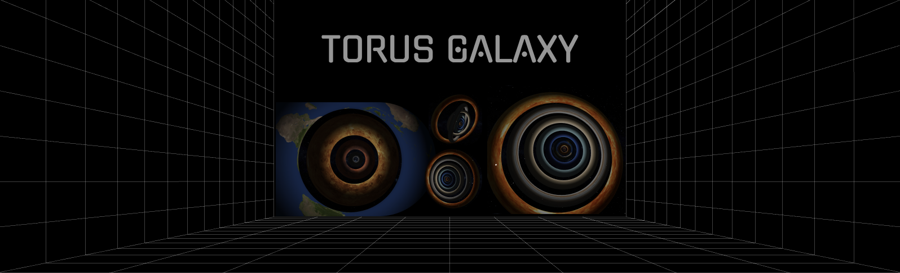

# Torus Galaxy

### Let's imagine we live in the Torus Galaxy 

Torus is a doughnut-shaped surface generated by a circle rotated about an axis in its plane that does not intersect the circle.

The ordering of planets by radius is done by the measurements from [Planets by Size](https://www.google.com/search?q=planets+ordered+by+size&rlz=1C5CHFA_enAM999AM999&oq=planets&aqs=chrome.0.69i59j69i57j0i512l3j46i512j0i512j0i67j0i512l2.4359j0j1&sourceid=chrome&ie=UTF-8).
Rotatinon speed ordering is done by [Ordering by Rotation Speed](https://sos.noaa.gov/catalog/datasets/planet-rotations/).

### Installation
`npm i && npm run dev`

## License
MIT
